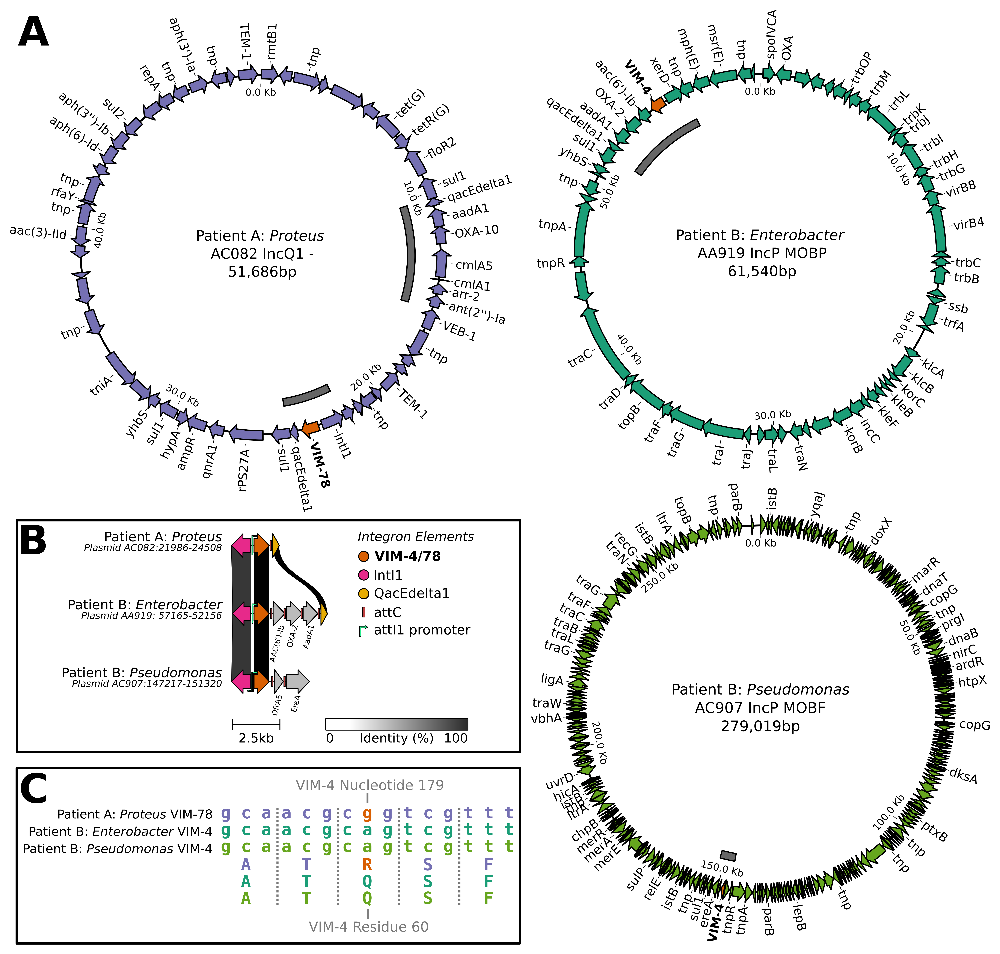
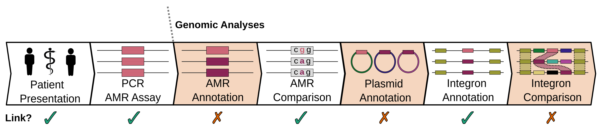

# VIM Beta-Lactamase Linkage Analysis

Hybrid sequencing study investigating whether 3 isolates from 2 patients that tested PCR positive for Verona integron-encoded metallo-β-lactamase (VIM) were likely to be linked via mobilisation of VIM.
Each sample was sequenced via Nanopore with plasmid miniprep and general easyMAG libraries and via MiSeq before quality control with 

- Quality control was performed using `fastp --length_required 100` (v0.23.4) for short reads and `filtlong --min_length 3000` (v0.2.1) for combined miniprep and easyMAG long reads
- Initial hybrid assemblies were generated for each isolate (unicycler v0.5.0: short-read assembly and long-read scaffolding/resolution and dragonflye v1.0.14: long-read first and short-read polishing)
- The best performing assembly for each isolate was selected on the basis of circular contigs and N50 (quast v5.2.0). See `hybrid_assemblies/` `hybrid_assemblies/qc_assembly_quast.sh` for final assemblies and example run script.
- These were used to determine:
    - Isolate taxonomy (GTDB-TK v2.1.1 w/ GTDB release207v2): `taxonomy_gtdb`
    - Identify plasmids (mob-suite v3.1.7) and AMR genes (bmrfinderplus v3.11.17 w/ DB v2023-08-08.2) present: `hybrid_assemblies/{amrfinderplus,mob_suite}` `hybrid_assemblies/plasmid_amr_annotate.sh`
- Due to sparsity of annotation for Pseudomonas VIM-bearing plasmid 

- VIM-bearing plasmids were extracted from assemblies (and in the case of Pseudomonas putida's large but poorly annotated plasmid - reassembled using trycycler v0.5.4 (following this [protocol](https://github.com/rrwick/Trycycler/wiki/Generating-assemblies) i.e., long-read assembly and contig clustering/reconciliation of raven v6.10.0, miniasm v0.3-r179, flye v2.9.2-b1786 assemblies followed by medaka v1.8.0 /w `r941_min_hac_g507` and polypolish v0.5.0 short read polishing). See `vim_plasmids` (and vim_plasmids/pputida_trycycler.sh` for pputdia VIM-plasmid trycycler example run script).

- Each VIM plasmid was then:
    - Re-identified (mob-suite v3.1.7) `vim_genes/{annotate.sh,mobsuite}`
    - Annotated (Bakta v1.8.2 w/ Full DB v2023-02-20 including amrfinderplus v4.11.17 w/ DB v2023-08-08.2): `vim_genes/{annotate.sh,mobsuite}` 
    - VIM genes sequences extracted and aligned (mafft v7.515): `vim_genes/`
    - Integron-finder (integron_finder v2.0.2 w/ HMMs from AMRFinderPlus DB v2023-08-08.2): `vim_integrons/`

- Data visualisation was performed as follows in `plots`:
    - Plasmids were virusalised with pycirclize v0.5.1: `plots/pycirclize_plot.py`
    - Integrons with visualised with clinker v0.0.26 `plots/run.sh`
    - VIM alignment via AliView v1.26 and inkscape v1.3 0e150ed6c4
    - Figures were combined and edited in inkscape v1.3 0e150ed6c4 

## Sample Data

| **Accession** 	| **Title**                                                      	| **Data Archive** 	| **Links**                   	| **BioSample**                          	| **BioProject** 	| **Release Date** 	| **SRA.filename**                                               	| **BioSample.organism_name** 	|
|---------------	|----------------------------------------------------------------	|------------------	|-----------------------------	|----------------------------------------	|----------------	|------------------	|----------------------------------------------------------------	|-----------------------------	|
| SRR26458397   	| Genomic sequencing of CPO Pseudomonas clinical isolate         	| SRA              	| BioSample: 1, BioProject: 1 	| SAMN37915621                           	| PRJNA1030769   	| 2023-10-21       	| Pseudomonas_short_R1.fastq.gz, Pseudomonas_short_R2.fastq.gz   	| Pseudomonas putida          	|
| SRR26458396   	| Genomic sequencing of CPO Pseudomonas clinical isolate         	| SRA              	| BioProject: 1, BioSample: 1 	| SAMN37915621                           	| PRJNA1030769   	| 2023-10-21       	| Pseudomonas_combined_long.fastq.gz                             	| Pseudomonas putida          	|
| SRR26458395   	| Genomic sequencing of CPO Enterobacter clinical isolate        	| SRA              	| BioSample: 1, BioProject: 1 	| SAMN37915572                           	| PRJNA1030769   	| 2023-10-21       	| Enterobacter_short_R1.fastq.gz, Enterobacter_short_R2.fastq.gz 	| Enterobacter soli           	|
| SRR26458394   	| Genomic sequencing of CPO Enterobacter clinical isolate        	| SRA              	| BioProject: 1, BioSample: 1 	| SAMN37915572                           	| PRJNA1030769   	| 2023-10-21       	| Enterobacter_combined_long.fastq.gz                            	| Enterobacter soli           	|
| SRR26458393   	| Genomic sequencing of CPO Proteus clinical isolate             	| SRA              	| BioProject: 1, BioSample: 1 	| SAMN37915571                           	| PRJNA1030769   	| 2023-10-21       	| Proteus_short_R1.fastq.gz, Proteus_short_R2.fastq.gz           	| Proteus mirabilis           	|
| SRR26458392   	| Genomic sequencing of CPO Proteus clinical isolate             	| SRA              	| BioSample: 1, BioProject: 1 	| SAMN37915571                           	| PRJNA1030769   	| 2023-10-21       	| Proteus_combined_long.fastq.gz                                 	| Proteus mirabilis           	|
| SAMN37915621  	| Pathogen: clinically-associated Pseudomonas putida             	| BioSample        	| BioProject: 1, SRA: 2       	| SAMN37915621                           	| PRJNA1030769   	| 2023-10-21       	|                                                                	| Pseudomonas putida          	|
| SAMN37915572  	| Pathogen: clinically-associated Enterobacter soli              	| BioSample        	| BioProject: 1, SRA: 2       	| SAMN37915572                           	| PRJNA1030769   	| 2023-10-21       	|                                                                	| Enterobacter soli           	|
| SAMN37915571  	| Pathogen: clinically-associated Proteus mirabilis              	| BioSample        	| SRA: 2, BioProject: 1       	| SAMN37915571                           	| PRJNA1030769   	| 2023-10-21       	|                                                                	| Proteus mirabilis           	|
| PRJNA1030769  	| Clinical Carbapenemase Producing Organism Genomic Surveillance 	| BioProject       	| BioSample: 3, SRA: 6        	| SAMN37915621,SAMN37915571,SAMN37915572 	| PRJNA1030769   	| 2023-10-21       	|                                                                	|                             	|

### Supplemental Methods

Illumina reads were trimmed for sequencing adapters and low quality regions using fastp (v0.23.2) and nanopore reads were filtered to those >=3000bp using filtlong (v0.2.1). Read statistics were calculated using seqkit (v2.3.0). Each hybrid set of reads were then combined and assembled using both DragonFlye (v1.0.14) and Unicycler (v0.5.0) (i.e., long-read and short-read first hybrid assembly approaches). QUAST (v5.2.0) was then used to determine the least fragmented assembly with the most closed contigs for each isolate. The resulting “best assembly” for each isolate were then analysed for AMR genes using AMRFinderPlus (v4.11.17 with database v2023-08-08.2), for plasmids using Mob-Suite (v3.1.7), for integrons using integron-finder (v2.0.2), and annotated in general via Bakta (v1.8.2 with database v2023-02-20) Taxonomy was determined using the Genome Taxonomy Database Tookit (v2.1.1) with database release 207v2 VIM alleles were aligned using mafft (v7.515) and visualised using AliView (v1.26). Detected plasmids were visualised using pycirclize (v0.5.1) and VIM-integrons compared with Clinker (v0.0.26). Figures were then arranged for presentation in inkscape (v1.3). Further analysis details, scripts, accession information, and results can be found in https://github.com/maguire-lab/vim_linkage_analysis (10.5281/zenodo.10032195).
